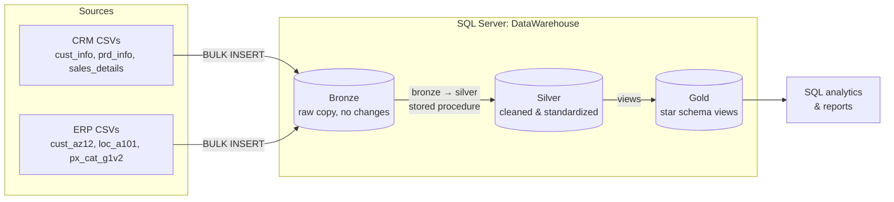
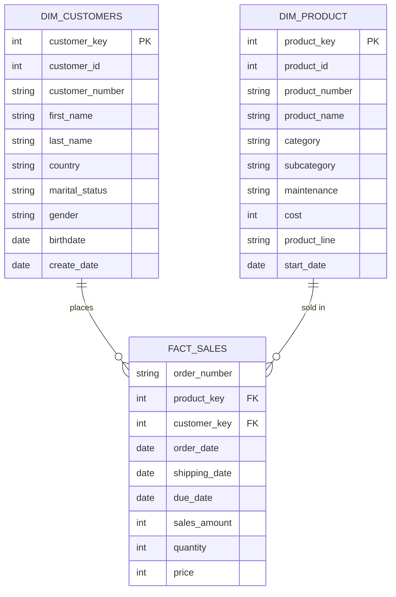

# SQL Data Warehouse & Sales Analytics (Medallion Architecture)

A SQL Server data warehouse that integrates two source systems (CRM and ERP) into a star schema using the **Bronze → Silver → Gold** medallion pattern, followed by a SQL analytics layer that produces customer and product reports.

**Stack:** SQL Server (T-SQL) · Stored procedures · Window functions · CTEs · Views

> **[TODO] Before publishing:** search this file for `[TODO]` and resolve every one. Delete any section you can't back up with something real in the repo. This draft assumes the blocker fixes from the code review are done (runnable scripts, surrogate keys in the fact table, tests folder populated).

---

## Table of Contents

1. [Project Goals](#project-goals)
2. [Architecture](#architecture)
3. [Source Data](#source-data)
4. [Data Model (Gold Layer)](#data-model-gold-layer)
5. [Transformations & Data Quality](#transformations--data-quality)
6. [Analytics](#analytics)
7. [Key Findings](#key-findings)
8. [Repository Structure](#repository-structure)
9. [How to Run](#how-to-run)
10. [Testing](#testing)
11. [Design Decisions & Limitations](#design-decisions--limitations)
12. [What I Learned](#what-i-learned)
13. [Acknowledgements](#acknowledgements)
14. [License](#license)

---

## Project Goals

- Consolidate customer, product and sales data from **two disconnected source systems** into one queryable model.
- Clean and standardize inconsistent source data (mixed codes, invalid dates, wrong calculated values, duplicate records).
- Expose a **star schema** that analysts can query without knowing anything about the source systems.
- Answer business questions on sales trends, product performance and customer behavior.

---

## Architecture



| Layer | Purpose | Load method |
|---|---|---|
| **Bronze** | Raw, unmodified copy of source files. Kept as-is so any issue can be traced back to the source. | `bronze.load_bronze` — truncate and `BULK INSERT` |
| **Silver** | Cleaned, de-duplicated, standardized tables. Adds an audit column (`dwh_create_date`). | `silver.load_silver` — truncate and insert from Bronze |
| **Gold** | Business-ready star schema (dimensions + fact) exposed as views. | Views over Silver |

---

## Source Data

Six CSV files from two systems:

| System | File | Content |
|---|---|---|
| CRM | `cust_info.csv` | Customer master records |
| CRM | `prd_info.csv` | Product records with cost, line and validity dates |
| CRM | `sales_details.csv` | Order lines (dates stored as `yyyymmdd` integers) |
| ERP | `cust_az12.csv` | Customer birthdate and gender |
| ERP | `loc_a101.csv` | Customer country |
| ERP | `px_cat_g1v2.csv` | Product category, subcategory, maintenance flag |

**[TODO]** State where the data came from (public dataset, course material, synthetic), its license, and approximate row counts per file. The `datasets/` folder is currently empty; either add the files (if licensing permits) or link to the source.

---

## Data Model (Gold Layer)



**Grain of `fact_sales`:** one row per order line (order number + product).

**Integration logic**
- `dim_customers` combines CRM customer info with ERP birthdate/gender and ERP country. Gender uses CRM as the master source and falls back to ERP when CRM is `n/a`.
- `dim_product` combines CRM products with ERP category data and keeps only the **current** version of each product.

**[TODO]** Confirm the diagram matches your final DDL exactly (column names, whether keys are persisted). Add a `dim_date` here if you build one.

---

## Transformations & Data Quality

Cleaning rules applied in the Bronze → Silver step:

| Table | Issue | Rule |
|---|---|---|
| `crm_cust_info` | Duplicate customer records | Keep the latest record per `cst_id` by `cst_create_date` (`ROW_NUMBER`) |
| `crm_cust_info` | Whitespace, coded values | `TRIM` names; `S/M` → Single/Married; `F/M` → Female/Male; otherwise `n/a` |
| `crm_prd_info` | Composite product key | Split `prd_key` into `cat_id` and product key |
| `crm_prd_info` | Missing cost | Default `NULL` cost to `0` |
| `crm_prd_info` | Product line codes | `M/R/S/T` → Mountain / Road / Other Sales / Touring |
| `crm_prd_info` | No end date | Derive end date as (next start date − 1 day) using `LEAD` |
| `crm_sales_details` | Dates stored as integers | Convert `yyyymmdd` to `DATE`; `0` or malformed values → `NULL` |
| `crm_sales_details` | Wrong or missing sales | Recalculate `sales = quantity × ABS(price)` when missing, non-positive, or inconsistent |
| `crm_sales_details` | Invalid price | Derive `price = sales / quantity` |
| `erp_cust_az12` | Key prefix mismatch | Strip `NAS` prefix so IDs join to CRM |
| `erp_cust_az12` | Future birthdates | Set to `NULL` |
| `erp_loc_a101` | Key format, country codes | Remove `-` from IDs; `DE` → Germany, `US`/`USA` → United States; blank → `n/a` |

**[TODO]** Add a short table of *how many rows each rule affected* (for example "N duplicate customers removed", "N invalid order dates set to NULL"). This is the most convincing evidence that the cleaning was real. Capture the counts in the pipeline log if you build one.

---

## Analytics

The `Analytics_scripts/` folder builds from basic exploration up to reusable reports:

| Stage | Scripts | Question answered |
|---|---|---|
| Exploration | 01–04 | What is in the warehouse? Date range, dimensions, headline KPIs |
| Magnitude | 05 | How are customers, products and revenue distributed across categories and countries? |
| Ranking | 06 | Which products and customers perform best and worst? |
| Change over time | 07–08 | How do sales trend by month and year? Running totals |
| Performance | 09 | Year-over-year change per product versus its own average |
| Segmentation | 10 | Product cost bands and customer segments (VIP / Regular / New) |
| Part-to-whole | 11 | Which categories drive overall sales? |
| Reports | 12–13 | `gold.report_customers` and `gold.report_products` views with KPIs (recency, average order value, monthly spend, lifespan) |

**Segment definitions**
- **VIP:** at least 12 months of history and total spend above 5,000
- **Regular:** at least 12 months of history and spend of 5,000 or less
- **New:** less than 12 months of history
- **Product segments (by total sales):** High-Performer above 50,000 · Mid-Range 10,000 or more · Low-Performer below 10,000

---

## Key Findings

> **[TODO]** This is the section recruiters read first. Run the analytics on your loaded warehouse and fill in real numbers. Do not leave placeholders in the published version.

| # | Finding | Evidence | Suggested action |
|---|---|---|---|
| 1 | **[TODO]** e.g. which category drives most revenue | **[TODO]** % of total sales, chart | **[TODO]** |
| 2 | **[TODO]** e.g. sales trend across years | **[TODO]** | **[TODO]** |
| 3 | **[TODO]** e.g. customer concentration (VIP share of revenue) | **[TODO]** | **[TODO]** |
| 4 | **[TODO]** e.g. products that are high-volume but low-revenue | **[TODO]** | **[TODO]** |
| 5 | **[TODO]** e.g. geographic distribution | **[TODO]** | **[TODO]** |

Add charts or dashboard screenshots to `docs/` and reference them here:

```markdown

```

---

## Repository Structure

```
.
├── Analytics_scripts/        # 13 analysis scripts + 2 report views
├── datasets/                 # Source CSVs (source_crm/, source_erp/)
├── docs/                     # Diagrams, data catalog, charts
├── scripts/
│   ├── init_database.sql     # Creates DataWarehouse DB and bronze/silver/gold schemas
│   ├── bronze/
│   │   ├── ddl_bronze.sql        # Bronze table definitions
│   │   └── proc_load_bronze.sql  # bronze.load_bronze
│   ├── silver/
│   │   ├── ddl_silver.sql        # Silver table definitions
│   │   └── proc_load_silver.sql  # silver.load_silver
│   └── gold/
│       └── ddl_gold.sql          # Dimension and fact views
├── tests/                    # Data quality checks
├── LICENSE
└── README.md
```

---

## How to Run

**Prerequisites**
- SQL Server **2022 or later** (the analytics use `DATETRUNC`)
- SSMS or Azure Data Studio
- The six source CSV files placed under `datasets/source_crm/` and `datasets/source_erp/`

**Steps** (run in this order)

1. `scripts/init_database.sql` — creates the `DataWarehouse` database and the `bronze`, `silver` and `gold` schemas. **This drops the database if it already exists.**
2. `scripts/bronze/ddl_bronze.sql` — creates Bronze tables.
3. `scripts/bronze/proc_load_bronze.sql` — creates the procedure. First update the `BULK INSERT` file paths to match where the CSVs live on your machine, then run:
   ```sql
   EXEC bronze.load_bronze;
   ```
4. `scripts/silver/ddl_silver.sql` — creates Silver tables.
5. `scripts/silver/proc_load_silver.sql` — creates the procedure, then run:
   ```sql
   EXEC silver.load_silver;
   ```
6. `scripts/gold/ddl_gold.sql` — creates the Gold views.
7. Run any script in `Analytics_scripts/`, starting with `01_`.

**[TODO]** Replace this with a one-command setup once you add it (for example a `run_all.sql` and a `docker-compose.yml` with a SQL Server container). "Clone, run one command, get a working warehouse" is a strong signal for reviewers.

---

## Testing

**[TODO]** Fill in once `tests/` is populated. Suggested checks to implement and document here:

- Primary key uniqueness on `dim_customers` and `dim_product`
- No orphan rows: every `fact_sales` key exists in its dimension
- No unexpected `NULL` in required columns
- Row-count reconciliation: Bronze → Silver → Gold
- Accepted values (for example gender is only Male / Female / n/a)
- Business rule: `sales_amount = quantity × price`

Describe how to run the checks and what a passing run looks like.

---

## Design Decisions & Limitations

Being explicit about trade-offs:

- **Full refresh, not incremental.** Both load procedures truncate and reload everything. Simple and idempotent, but it wouldn't scale to large or frequently changing data.
- **Gold layer is views, not tables.** Always current and cheap to maintain, but recomputed on every query. **[TODO]** If you persist the dimensions to keep surrogate keys stable, say so here.
- **Products keep only the current version (Type 1 behavior).** Historical validity dates are computed in Silver but not carried into Gold, so historical cost and price changes are not tracked. **[TODO]** Update if you implement SCD Type 2.
- **Cleaning rules are judgment calls.** For example, missing costs default to 0 and invalid sales are recalculated from price × quantity. These choices are documented above but should be validated with a business owner in a real setting.
- **No orchestration or scheduling.** Procedures are run manually.

**Possible next steps:** incremental loads with a watermark, SCD Type 2, a date dimension, automated tests in CI (GitHub Actions with a SQL Server container), and a BI dashboard on top of the Gold layer.


---

## License

Released under the [MIT License](LICENSE).

## Author

**[TODO]** Your name · [LinkedIn](#) · [Email](#)
